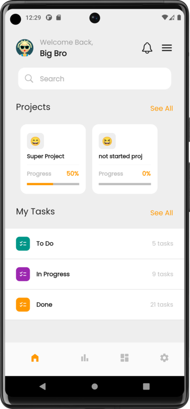
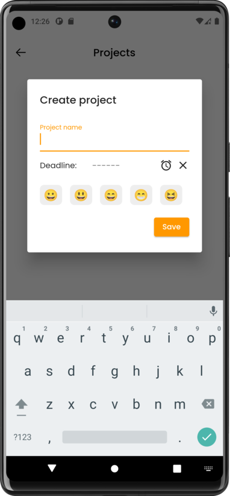
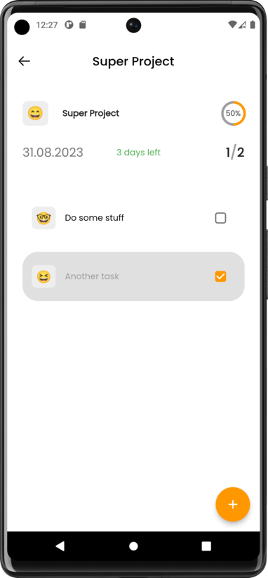
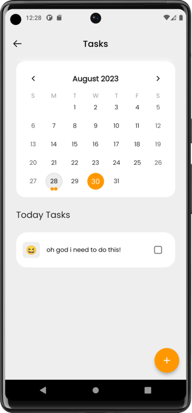

# flutter_todo_app

Practice project. UI Design was taken from https://dribbble.com/shots/19846532-Productivity-Mobile-App

## Technical information

### Database

SQLite (sqflite library) used for storing data

### State Management

BLoC (flutter_bloc library) used for global state management

## Screenshots  

  

  

  

